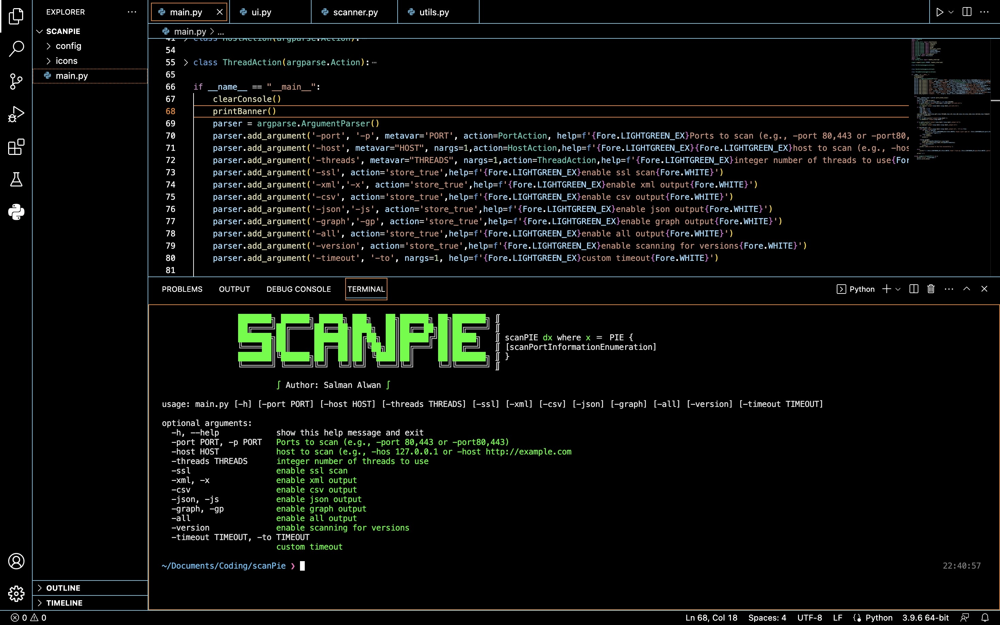

<h1 align="center">
  </a>
  <br>
</h1>

<h4 align="center">Command-Line Port Scanner</h4>

<p align="center">
  <a href="#description">Description</a> •
  <a href="#installation">Installation</a> •
  <a href="#usage">Usage</a> •
  <a href="#options">Options</a> •
  <a href="#output">Output</a> •
  <a href="#license">License</a>
</p>

---

## Overview


## Description

scanPie is a powerful command-line tool designed for port scanning. It efficiently detects open ports on a specified host, providing essential information about the scanned ports. The tool supports multi-threading for faster scanning and offers additional features such as SSL scanning, version detection, and customizable timeout settings. It provides various output options, including XML, CSV, JSON, and graph visualizations. scanPie is easy to use and offers a clean and organized output.

## Installation

1. Clone the repository:
```shell
git clone ttps://github.com/SalmanAlwann/scanPie.git
```

2. Navigate to the project directory:
```shell
cd scanPie
```

## Usage

To run the scanPie tool, use the following command:

```shell
python scanPie.py -host <host> -port <port> -threads <threads> [options]
```

Replace `<host>` with the target host IP address or URL and `<port>` with one or more ports to scan. `<threads>` specifies the number of threads to use for scanning.

## Options

The tool provides several options to customize the scanning process:

- `-ssl`: Enable SSL scanning.
- `-xml`, `-csv`, `-json`: Enable XML, CSV, or JSON output format.
- `-graph`: Enable graph output for port distribution visualization.
- `-all`: Enable all output options (XML, CSV, JSON, and graph).
- `-version`: Enable scanning for service versions.
- `-timeout <value>`: Set a custom timeout value (in seconds).

## Output

After the scan, scanPie generates the following output:

- Open ports: A list of open ports found during the scan.
- SSL information: If SSL scanning is enabled, SSL-related information for open ports is displayed.
- Version detection: If version scanning is enabled, detected service versions are shown.
- Output files: The tool saves scan results in an output directory, including a text file with a list of open ports and, if applicable, SSL information.
